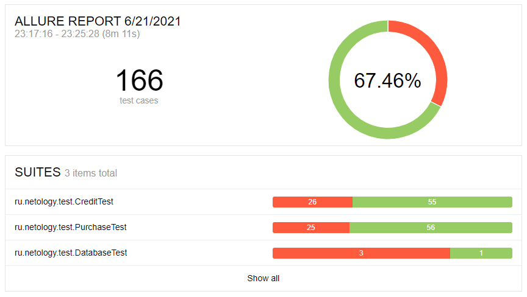

# Отчет по итогам тестирования

## Краткое описание

В период с 01.06.2021 по 14.06.2021 в соответствии с [планом](Plan.md) было проведено тестирование приложения "Путешествие дня".

* В ходе автоматизации тестирования были реализованы позитивные и негативные сценарии заполнения страниц в SUT.
* Подтверждена поддержка двух баз данных - MySQL и PostgreSQL.

Протестирована возможность базы данных сохранять информацию о платеже и успешности его проведения.

## Тест-кейсы

Количество тест-кейсов — 166:
- для страницы "Покупка по карте" — 81;
- для страницы "Покупка в кредит" — 81;
- для базы данных — 4.

Результат выполнения автотестов:

## Общие рекомендации

Исходя из результатов тестирования необходимо:

- Разработать спецификацию для приложения.
- Исправить описанные ошибки (15):

    

      
Для страницы "Путешествие дня

      - [Содержимое тега <title> не соответствует названию страницы "Путешествие дня"](https://github.com/aeontal/Diploma/issues/1)
      - [Орфографическая ошибка в содержании предложения "Путешествие дня"](https://github.com/aeontal/Diploma/issues/15)
      

   
    

      
Для страницы "Покупка по карте"

      - [Покупка по карте. Текст ошибки под пустыми полями не соответствует причине ошибки](https://github.com/aeontal/Diploma/issues/2)
      - [Покупка по карте. Возможность отправки некорректного значения в поле "Владелец"](https://github.com/aeontal/Diploma/issues/4)
      - [Покупка по карте. Возможность отправки некорректного значения в поле "Месяц"](https://github.com/aeontal/Diploma/issues/6)
      - [Покупка по карте. Два всплывающих сообщения (об отказе и об успехе операции)](https://github.com/aeontal/Diploma/issues/8)
      - [Покупка по карте. Некорректное сообщение при отправке формы с использованием невалидной карты](https://github.com/aeontal/Diploma/issues/11)
      - [Покупка по карте. Сообщения об ошибке больше чем в одном поле](https://github.com/aeontal/Diploma/issues/13)
      

   
    

      
Для страницы "Покупка в кредит"

      - [Покупка в кредит. Текст ошибки под пустыми полями не соответствует причине ошибки](https://github.com/aeontal/Diploma/issues/3)
      - [Покупка в кредит. Возможность отправки некорректного значения в поле "Владелец"](https://github.com/aeontal/Diploma/issues/5)
      - [Покупка в кредит. Возможность отправки некорректного значения в поле "Месяц"](https://github.com/aeontal/Diploma/issues/7)
      - [Покупка в кредит. Два всплывающих сообщения (об отказе и об успехе операции)](https://github.com/aeontal/Diploma/issues/9)
      - [Покупка в кредит. Некорректное сообщение при отправке формы с использованием невалидной карты](https://github.com/aeontal/Diploma/issues/10)
      - [Покупка в кредит. Сообщения об ошибке больше чем в одном поле"](https://github.com/aeontal/Diploma/issues/12)
      

   
    

      
Для базы данных

      - [Неверный внешний ключ в таблице credit_request_entity](https://github.com/aeontal/Diploma/issues/14)
      

